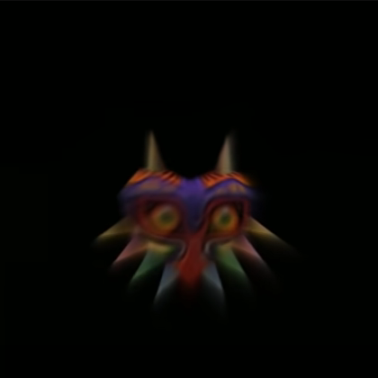
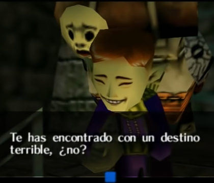

# Majora's Mask Project

## HTML, CSS & JAVASCRIPT

El siguiente proyecto consta de una página web, la cual recrea la pantalla de inicio del videojuego la máscara de majora. 
Pone en práctica conceptos como animaciones css avanzadas, manipulación del documento html, eventos con javascript y uso de api de sonido.
Espero sea de su agrado y gracias por ver.
***

## Referencia

Autor: [Grace Silva](https://github.com/Grace-Silva)
[Ver Proyecto](https://grace-silva.github.io/Majoras-Mask-Project/)
[Ver Juego Original](https://www.nintendo.es/Juegos/Nintendo-64/The-Legend-of-Zelda-Majora-s-Mask-269525.html)
